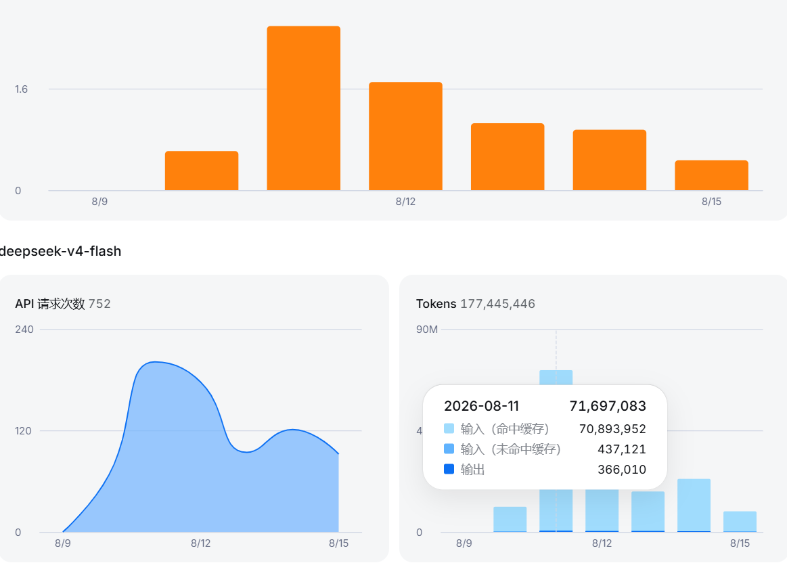

# 契约驱动开发 · Contract-Driven Development

给 AI 立规矩的「宪法」+ 强制执行守卫，让 AI 写的代码「一次过」。

> 每次新会话，AI 都会失忆一次。契约驱动开发把架构、接口、数据、安全、规范固化成 AI 看得懂的契约文件，再用守卫强制 AI 动手前先读、完成后必交作业。
>
> 一个 4 万行、纯 agent 编写的小程序，用它跑了 5 天：**1.5 亿 token，只花了 ¥6.35，缓存命中率 99.4%，基本没有返工。**

## 它解决什么

- **重复造轮子**：AI 不知道模块已存在，又在别的文件写了一遍
- **数据混乱 / 接口不一致**：同一份数据几种叫法，调用全靠猜
- **随手发挥**：说好的架构，写着写着就改了
- **扫库爆窗**：让它扫一遍项目，还没干活上下文就满了

## 装完怎么用（3 分钟上手）

1. **放进你的项目**：复制本仓库到项目根目录，或下载 `contract-driven-development-v2.4.0.zip` 解压
2. **安装守卫**（一键）：Windows 跑 `skills\install.ps1`，macOS/Linux 跑 `bash skills/install.sh`
3. **填项目基线**：打开 `INDEX.md` → 「待填入基线」，填项目名称和业务域（第一次约 10 分钟，以后不用动）
4. **直接开工，不用手动提醒**：`AGENTS.md` 会被 AI 自动读取，守卫自动生效
5. **AI 会自动这样做**：任务分级（T0-T3）→ 读对应契约 → 编码 → 自检汇报

> 第一次任务长这样（AI 的执行输出示例）：
>
> ```
> [规模: T1] 开始任务
> → 读取 INDEX.md … 采用级别: Standard
> → 读取 STANDARD.md … 规范已加载
> → 读取 MODULE.md … 定位到 MOD-003 订单模块
> ✅ 编码完成 · 无越界行为
> ⚠️ 自检: API.md 已更新 · 其余无需更新
> ```

## 它适合什么项目？（随项目增长，不头轻脚重）

很多人一看 10 份契约就觉得「小项目用不上」——实际上这套系统是**随项目增长**的：

- **从小开始**：Lite 模式只要 3 步、5 份文件（INDEX / PROJECT / STANDARD / API / MODULE）；项目变大再按 Standard（7 步）、Full（11 步）升级
- **复杂度自动判定**：PCS 评分按模块/接口/表/决策/环境自动分级，不用自己拍脑袋
- **随代码长大**：接口超 50 个自动分片到模块契约，模块多了再拆模块契约——契约跟着代码长
- **和 AI 写作频率强相关**：契约省的是「每次 AI 动手前的定位成本 + 返工成本」。哪怕只有几千行的项目，只要你高频让 AI 改代码，它每次都要重新认识项目；契约一次建立，每次复用。**AI 写得越频繁，收益越大**

## 真实运行数据（DeepSeek V4 Flash · 5 天）



| 指标 | 数值 |
|---|---|
| 总请求 | 580 次（5 天） |
| 总 token | 1.5 亿 |
| 总费用 | ¥6.35 |
| 平均每次请求 | ≈¥0.011 |
| 缓存命中率 | 99.4% |
| 返工 | 基本为 0 |

5 天中的 3 天明细：

| 日期 | 请求 | 总 token | 缓存命中率 |
|---|---|---|---|
| 08-10 | 67 | 1116 万 | 98.4% |
| 08-11 | 201 | 7169 万 | 99.4% |
| 08-12 | 177 | 4406 万 | 99.4% |

99.4% 缓存命中意味着：上下文几乎全部在复用，AI 没有反复探索。对比没有契约的全库扫描（一次定位几十万 token），契约定位只读 3 个文件。

## 核心特性

- **10 份契约 + 模块契约**：INDEX / PROJECT / STANDARD / API / DATA / MODULE / DECISION / TEST / SECURITY / DEPLOY
- **强制执行守卫**：任务开始先分级（T0-T3），按需读契约，完成必须自检
- **冲突优先级**：SECURITY > PROJECT > STANDARD > 模块契约 > DATA > API > MODULE > DEPLOY > TEST > DECISION
- **渐进接入**：Lite（3 步）/ Standard（7 步）/ Full（11 步）
- **变更历史进 .git**，语义理由进 CHANGELOG.md

## 目录结构

```
INDEX.md          契约总导航（唯一入口）
PROJECT.md        架构设计、模块边界、架构红线
STANDARD.md       代码规范、命名约定、性能约束
API.md            接口定义（超 50 个自动分片）
DATA.md           数据模型（超 50 张自动分片）
MODULE.md         模块目录索引
DECISION.md       技术决策记录（ADR）
TEST.md           测试策略
SECURITY.md       安全红线（最高优先级）
DEPLOY.md         部署与运维
modules/          模块契约（每个模块一份）
CHANGELOG.md      变更语义档案
skills/           多环境安装脚本 + 守卫主文件
AGENTS.md         Agent 通用入口
```

## License

MIT
